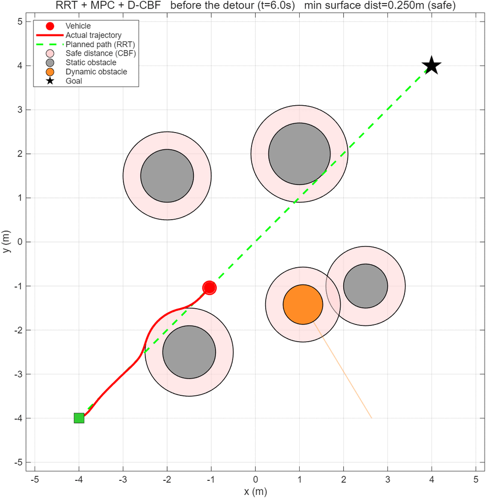
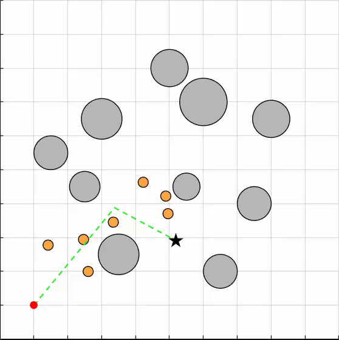

# MPC-D-CBF: RRT + MPC + Discrete CBF Safe Navigation (MATLAB 2D)

A self-contained MATLAB 2D simulation of safety-critical navigation for a unicycle robot among static circular obstacles and dynamic obstacles that randomly cross the planned path.

Safety is enforced by a Discrete-time Control Barrier Function (D-CBF) integrated into the Model Predictive Control (MPC) loop, combined with global path planning via RRT (Rapidly-exploring Random Tree).

## Architecture

```
RRT (global planning)  ->  MPC (local tracking)  ->  D-CBF (safety)
```

- **RRT** — global path planning around static obstacles + greedy shortcut smoothing
- **MPC** — nonlinear MPC solved with `fmincon` (SQP); cost = position tracking + heading wrap + control penalty
- **D-CBF** — discrete-time control barrier function chain enforced as hard constraints over the MPC horizon

## Demo

### Key-frame loop (`visualize.m`)



Three key frames (before detour / just passing / goal reached) looped at 1 s per frame.

### Full 5/5-goal simulation (`simulate.m`)



A full `simulate` run with 5 consecutive random goals, 10 static obstacles, and 7 dynamic obstacles.

## Control formulation

### System model

Unicycle robot, explicit Euler discretization with sampling time $T = 0.1$ s:

$$
x_{k+1} = x_k + T\,v_k \cos\theta_k, \qquad
y_{k+1} = y_k + T\,v_k \sin\theta_k, \qquad
\theta_{k+1} = \theta_k + T\,\omega_k
$$

State $[x, y, \theta]$, control $u = [v, \omega]$. This is exactly the state update in the simulation loop of `simulate.m` and `visualize.m`.

### MPC problem

At each step, a horizon-$N$ ($N = 12$) optimal control problem is solved with `fmincon` (SQP). The decision variable is $z = [v_1, \dots, v_N, \omega_1, \dots, \omega_N]^\top \in \mathbb{R}^{2N}$:

$$
\min_z \; J = \sum_{k=1}^{N} \Big[ Q_{xy}\!\left(e_{x,k}^2 + e_{y,k}^2\right) + Q_{\theta}\, e_{\theta,k}^2 + R_v \cdot v_k^2 + R_{\omega} \cdot \omega_k^2 \Big] + P_{xy}\!\left(e_{x,N+1}^2 + e_{y,N+1}^2\right)
$$

with tracking errors (heading error is wrapped to $(-\pi, \pi]$):

$$
e_{x,k} = x_k - x_{k}^{\text{ref}}, \qquad
e_{y,k} = y_k - y_{k}^{\text{ref}}, \qquad
e_{\theta,k} = \text{atan2}\big(\sin(\theta_k-\theta_k^{\text{ref}}),\, \cos(\theta_k-\theta_k^{\text{ref}})\big)
$$

subject to control bounds

$$
0 \le v_k \le V_{\max}, \qquad |\omega_k| \le \Omega_{\max}
$$

Implemented in `mpc_cost` (stage + terminal cost) and `solve_mpc` (bounds + `fmincon`).

### D-CBF safety constraints

For each circular obstacle $j$ centered at $o_j$, define the safety function with effective radius $r_{\text{eff},j} = r_{j} + r_{\text{robot}} + d_{\text{safe}}$:

$$
h_j(x, o_j) = \lVert x - o_j \rVert - r_{\text{eff},j}
$$

Over the MPC horizon, for every step $k$ and every obstacle $j$, the following **hard constraints** (nonlinear inequality constraints returned by `mpc_nonlcon`, strictly enforced by `fmincon`) are imposed:

1. **Safety**: $\quad h_j(x_{k+1}, o_j(k{+}1)) \ge 0$ — the robot never enters the safety circle.
2. **Decaying chain (D-CBF)**: $\quad h_j(x_{k+1}, o_j(k{+}1)) \ge (1-\gamma)\, h_j(x_k, o_j(k))$ — the safety distance may shrink by at most $\gamma$ per step.

with $\gamma = 0.3$. If the solver returns exit flag $-2$ (truly infeasible), the robot stops ($u = 0$).

The same effective radius $r_{\text{eff}} = r_j + r_{\text{robot}} + d_{\text{safe}}$ is used to inflate obstacles during RRT collision checking (`seg_free`), so the reference path already respects the safety margin.

### Dynamic obstacles

Dynamic balls cross the RRT path back and forth perpendicular to it, driven by a triangle wave of period $4A$:

$$
o_j(t) = c_j + n_j \cdot \text{triWave}(v_j t + \phi_j, A_j)
$$

with amplitude $A = 1.2$ m and speed $v = 0.3$ m/s (`tri_wave` / `dyn_pos`). Their positions are predicted over the horizon in `obstacle_horizon` (constant-speed extrapolation), and the crossing center/direction are re-aligned to the RRT polyline whenever the path is rebuilt.

### Parameters

| Param | Value | Meaning |
| --- | --- | --- |
| $T$ (`DT`) | 0.1 s | sampling period |
| $N$ | 12 | MPC prediction horizon |
| $\gamma$ (`GAMMA`) | 0.3 | D-CBF decay rate |
| $V_{\max}$ / $V_{\min}$ | 1.0 / 0.0 m/s | linear speed bounds (no reversing) |
| $\Omega_{\max}$ | 1.0 rad/s | angular speed bound |
| $r_{\text{robot}}$ | 0.15 m | robot radius |
| $d_{\text{safe}}$ (`SAFE_D`) | 0.10 m (simulate) / 0.25 m (visualize) | extra safety margin |
| $r_{\text{goal}}$ (`GOAL_R`) | 0.25 m | goal-reaching radius |
| $V_{\text{ref}}$ | 0.8 m/s | reference linear speed |
| $Q_{xy},\, Q_{\theta},\, R_v,\, R_{\omega},\, P_{xy}$ | 10, 0.1, 0.01, 0.02, 50 | MPC cost weights |
| $A$, $v$ (dynamic balls) | 1.2 m, 0.3 m/s | crossing amplitude / speed |

### Algorithm pipeline

1. **RRT** (`rrt`): sample collision-free nodes (goal bias 0.1, step 0.5 m, ≤ 4000 iterations), then `shortcut` greedily prunes the path.
2. **Reference** (`make_ref`): sample the reference trajectory along the path at $V_{\text{ref}} T k$; rate-limit the reference heading (≤ 0.1 rad/step) to match the robot's turning capability.
3. **Prediction** (`obstacle_horizon`): static obstacles fixed, dynamic balls extrapolated at constant speed over the horizon.
4. **Solve** (`solve_mpc`): `fmincon` SQP solves the MPC + D-CBF problem; apply $u = [v_1, \omega_1]$.
5. **Integrate** and repeat until $\lVert x - x_{\text{goal}} \rVert < r_{\text{goal}}$ or the step limit is reached.

## Features

- Static circular obstacles + dynamic obstacles that cross the path (random positions / random phases)
- Consecutive random goals: reach one, sample the next
- Two-stage pipeline: offline computation, then real-time playback (frame rate independent of solver speed)
- Playback window with **Replay** and **Export video (MP4)** buttons
- Multi-scenario stress test (`test_suite.m`): arrival / collision / stuck statistics over many random scenes
- Static key-frame rendering (`visualize.m`): three PNG snapshots + optional in-figure loop playback

## Performance

| Scenario | Reached | Collision | Min surface distance |
|----------|---------|-----------|----------------------|
| simulate (5 consecutive goals, 10 static + 7 dynamic obstacles) | 5 / 5 | 0 | 0.103 m |
| test_suite(3 random scenes, with head-on obstacles) | 3 / 3 | 0 | 0.150 m (worst) |

## Getting started

**Requirements**:
- MATLAB R2025a
- Optimization Toolbox (provides `fmincon`)

No other toolboxes, no Python, no external dependencies.

```matlab
simulate            % compute full simulation, then playback animation
simulate(false)     % headless: compute only
visualize           % export static key-frame figures (mpc_cbf_before/result/final.png)
visualize(true)     % same + loop-play the three key frames in the figure (1 s/frame, 3 loops)
test_suite(50)      % stress test over 50 random scenes
```

## File structure

| File | Purpose |
| --- | --- |
| `simulate.m` | main simulation (two-stage: offline computation + playback animation) |
| `visualize.m` | static key-frame export + optional in-figure loop playback |
| `test_suite.m` | multi-scenario stress test (random static + dynamic obstacles) |
| `compute_balls.m` | helper: reverse-engineer dynamic-ball parameters so the encounter is timed to the robot's arrival |
| `mpc_cbf_*.png` | sample result figures (before / passing / final) |
| `simulation.gif` | exported 5/5-goal simulation animation |
| `visualize.GIF` | loop animation of the three key frames |
| `LICENSE` | MIT license |

## License

MIT — see `LICENSE`.